# HokieConnect System Diagram

```mermaid
classDiagram
    direction LR

    class Main {
        -ArrayList~Student~ students
        -ArrayList~Group~ groups
        -ArrayList~String~ locations
        +main(String[] args)
        +startConsole()
        +processCommand(String command, Scanner scanner)
        +addStudent(Scanner scanner)
        +addCoursesForCurrentStudent(Scanner scanner)
        +viewStudentSchedule(Scanner scanner)
        +makeGroups(ArrayList~Student~ studentList) ArrayList~Group~
        +doMakeGroups()
        +listStudents()
        +getStudents() ArrayList~Student~
        +getGroups() ArrayList~Group~
    }

    class Student {
        -String name
        -ArrayList~Course~ courses
        +Student(String name)
        +getName() String
        +getCourses() ArrayList~Course~
        +addCourse(Course course)
    }

    class Course {
        -String course_name
        -String time
        -String days
        -int startTime
        -int endTime
        -CourseCatalog course_catalog
        +Course(String course_name, String time, String days)
        +Course(String CRN)
        +getCourseName() String
        +getTime() String
        +getDays() String
        +getStartTime() int
        +getEndTime() int
        +toString() String
    }

    class Group {
        -Course course
        -ArrayList~Student~ members
        +Group(Course course, ArrayList~Student~ members)
        +getCourse() Course
        +getCourseName() String
        +getDays() String
        +getTime() String
        +getMembers() ArrayList~Student~
        +getStudents() ArrayList~Student~
        +size() int
        +isEmpty() boolean
        +addMember(Student student) boolean
        +removeMember(Student student) boolean
        +contains(Student student) boolean
        +matchesSection(Course other) boolean
        +toString() String
    }

    class CourseCatalog {
        +getCatalog() Map
    }

    class CatalogParts {
        <<course data>>
        CatalogPart001 through CatalogPartNNN
    }

    Main "1" o-- "many" Student : stores
    Main "1" o-- "many" Group : creates and stores
    Student "1" o-- "many" Course : takes
    Group "many" --> "1" Course : formed for
    Group "1" o-- "many" Student : contains
    Course ..> CourseCatalog : looks up CRN
    CourseCatalog *-- CatalogParts : loads
```

## How the system works

1. `Main` reads commands from the user.
2. Each `Student` stores the courses added to that student's schedule.
3. A course can be entered manually or found through `CourseCatalog` using a CRN.
4. `Main.makeGroups()` finds students who share the same course, days, and time.
5. `Main` creates a `Group` only when at least two students match.
6. Each `Group` stores one course and its list of students.
7. `Main` suggests a meeting time that does not overlap the members' classes and randomly selects a meeting location.

The test classes (`CourseTest`, `StudentTest`, `GroupTest`, and `MainTest`) test the four main classes but are not part of the running application.
